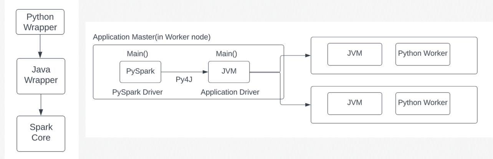

# Cluster란??
 <U>하나의 시스템으로 작동</U>하지만 방대한 데이터를 다루기 위해 <b>서로 연결 된 여러 개의 컴퓨터들</b>인 아키텍쳐를 클러스터라고 한다.

 아파치 같은 경우에는 클러스터들이 분산 컴퓨팅의 척추 역할을 하게 된다.

 # 클러스터의 종류
 * 온프라미스 클러스터
 * 클라우드 베이스든 클러스터
 * 하이브리드 클러스터

 # 클러스터를 사용하면 좋은 점

 * 향상된 성능
 > 일 처리에 대한 병행처리로 성능의 향상을 야기할 수 있다.

 * 비용 절감성
 > 하나의 슈퍼 컴퓨터 보다는 여러개의 일반 컴퓨팅에 분산되서 일 처리를 맡기므로 비용이 절감된다.

 * Scalability
 > 클러스터는 증가되는 업무량에 맞춰 성능을 증가시키거나 줄어드는 업무량에 따라 성능을 낮출 수도 있다.

 * Fault tolerance
 > 하드웨어부터 소프트웨어의 오류를 최대한 줄이도록 해준다.

 # Pyspark Runtime Architecture 

상단의 이미지에서 볼 수 있듯이, JVM을 통해서 각 클러스터의 노들의 어플리케이션 드라이버들을 활성화 한다.
그렇기 때문에 파이썬 워커가 돌기 위한 라이브러리를 최신화나 import하기 위해서는 Master node의 Pyspark에서 배포를 하겨 slave node 들에게도 해당 라이브러리들을 전파하게 해야 한다.

또, Spark core와의 컴파일 방식 단계를 보면 사용자 코드에서 Python wrapper를 통해 코드가 돌고, 해당 코드를 Java wrapper로 컴파일 후 Spark Core에 전달하는 방식으로 코드의 컴파일이 이루어진다.

