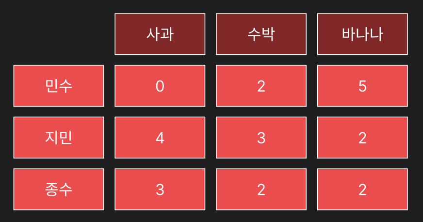

# Column_based vs Row_based
처음에는 어떤 것이 빠른지 for문을 돌릴 때 검증하듯이, 시간 복잡도 개념으로 보기도 하고, 테이블 그림을 그려, 가로 세로 길이를 재서 생각하는 바보 같은 도전을 했다. 왜 그랬는지 모르지만, 고민을 해보다가 일주일 동안 안풀리던 생각이 주말에 카페에서 공부하다가 medium 글의 그림을 보고 이해가 한번에 되었다. 그렇기 때문에 나같은 미련한 사람이 없기글 바라며, 그림으로 정보를 기록으로 남긴다.

이 두 가지 데이터 저장 방식을 비교하기 위해서는 엑셀의 격자무늬로 생각하기 보다는 <i>데이터가 어떤 형태로 관계를 갖고 저장되는지 </i>생각해보는 것이 가장 중요하다.

다음은 과일 가게에서 고객이 구매한 과일 종류에 대한 테이블이다.

# Row_based Table
나열해보면 row_based는 다음과 같이 나눠지게 된다.
민수 0 2 5 | 지민 4 3 2 | 종수 3 2 2

CSV 파일로 표현하자면, |는 행바꿈일 것이고, 띄어쓰기는 쉼표(,)다

아무튼 위의 표현을 보면 row_index 즉, primary key_인 이름을 기준으로 각 로우 단위로 값들이 저장된다고 생각하면 된다. 

# Column based Table
위의 Row based table과 다르게 저장되는 방식이 tree 방식으로 각 구간에 저장되기 때문에
다음과 같이 표현할 수 있다.

민수 지민 종수 | 0 4 3 | 2 3 2 | 5 2 2
로 볼 수 있다. 각 영역에 트리 node로 연결되어 각 데이터들이 들어간 형태다. 

이제 이렇게 보면 윤곽이 보일 수 있다. 예를 들어 다음 테이블에서 종수가 산 수박 갯수를 SELECT해서 찾아본다고 하면 ROW_based 같은 경우 종수가 있는 구간에 들어간 다음 column 수박의 column 인덱스만큼 이동해서 값을 찾아올 것이다. 반면, Column based 같은 경우 바로 수박 column에서 찾을 수 있기 때문에, 비교적 빠르게 검색이 가능한 것이다. 데이터가 작아서 효율성이 보이지 않겠지만, 실제로 몇 만개의 row와 column이 이루어져 있다면, 그저 column 이동만 이루어지기 때문에 시간 복잡도 상으로도 훨씬 더 빠르게 이동이 가능하고 분산 데이터에 더 적합한 형태를 갖추고 있다. 그렇기 때문에 빅데이터 관점에서 Column based 테이블은 필수이자, 기초인 테이블 설계다. 

쉽게 볼 수 있도록 다음과 같이 비교할 수 있다.

#### Row_based Storge의

* 장점: 데이터 조작이 편리, 작은 데이터를 가지는 테이블에서 조회가 용이
* 단점: 데이터 통합이 어려움, 큰 데이터을 가지는 데이터에서 조회가 불편, 같이 저정된 데이터의 종류가 다를 수 있어 압축률이 적다.

#### Column_based Storge의

* 장점: 데이터 통합이 편리, 큰 데이터를 가지는 테이블에서 조회가 용이, 데이터 통합이 용이, 같은 영역의 데이터들만 모아 저장했기 때문에 압축이 용이
* 단점: 데이터 조작이 불편, 작은 데이터에서 검색 속도가 느림