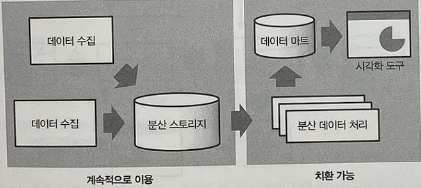

# 빅데이터의 배경과 정착
> 분산 시스템에 의한 데이터 처리의 고속화

* 점점 데이터, API, 크게는 벌크 데이터까지 점차 서비스 내에서 오고 가는 데이터의 양이 RDB로는 감당하기 어려울 만큼, 현재 데이터가 쌓이는 속도는 비약적으로 증가했고, 이를 처리하려면 기존과는 다른 구조에 대해서 생각해볼 필요가 있다.

* Hadoop: 전공 수업을 들었을 때, 달달 외우기만 했는데 막상 현업에서 공부하면서 이 기술이 얼마나 data engineering에서 정말 중요한 프로그램인지 뼈저리게 깨닫았다. 간단하게 말하면, 엄청난 양의 데이터가 들어왔을 때, 하나의 클러스터 또는 컴퓨터, 서버가 감당하기 어려운 데이터가 들어 왔을 때, 이를 저장하기 위해 나누어서 데이터를 저장하고 분산되어서 저장된 데이터에 대해서 불러오거나 저장, 삭제할 때 이를 관리하기 위한 시스템으로 Hadoop이 이를 관리한다.

* NoSQL: RDB의 제약(유일성을 증빙하기 위한 key[PK, SK 등], 데이터 무결성[개체 무결성, 참조 무결성] 등 ) 등, 실제로 데이터가 많다보면, 여러가지 조건으로 결국에는 RDB에서 필요로 하는 조건은 너무나도 불필요한 조건이기 때문에, NOSQL은 어쩌면 데이터 엔지니어 영역에서는 필수적인 요건이다.

# 분산시스템의 비즈니스 이용 개척
* 전통적인 DW에서도 대량의 데이터를 처리할 수 있으며, 여러 방면에서 Hadoop보다도 우수하나, 확장이 어려웠기 때문에 가속적으로 늘어나는 데이터의 처리는 Hadoop에 맡기고, 비교적 작은 데이터, 또는 중요한 데이터만을 DW에 넣는 식으로 사용을 구분하게 되었다. (index를 줄이는 방식)

# 데이터 파이프라인 
> 테이블에서 테이블, 또는 테이블에서 다른 시스템, 또는 저장소에서 다른 저장소로 갈 때의 연결을 데이터 파이프라인이라고 한다. 하지만 여기서 고려해야 할 점은 <b>데이터를 보내는 목적성</b>이다. 예를 들어, RDB로 만든 호텔 예약 서비스에서 매일 회원들의 예약 정보를 오전 4시에 배치 받는 서비스가 있다고 해보자. 그렇다면, 데이터 엔지니어라고 가정한다면 RDB가 어떤 SQL로 정의되었고 서비스의 서버가 구현하는 로직에 맞게끔 데이터를 쿼리문이나 다른 방법을 사용해서 정제해서 보내주는 아키텍쳐를 설계하는 것이 데이터 엔지니어의 역할이다.

데이터 파이프라인에서의 데이터 흐름은 크게 2가지로 분류된다.
1. Batch Processing
2. Data Streaming
문자 그대로 Batch는 일정 시간에 스케줄된 로직에 따라 데이터를 일정 시간에 보내는 방식이곡, Data Streaming은 서바나 ,클라이언트 딴에서 데이터를 요청한다면 데이터를 보내주는 방식이다. 그렇기 때문에, 요청을 위한 신호가 별도로 정의되어야 하며, batch에 비해 고려해야 할 점이 헤더나, 실시간으로 보냈을 때, 테이블에서 허용할 수 있을 정도의 능력에 대해서 고려해보는 것까지 많은 생각이 필요로 하는 작업이다.

## Data Pipeline 아키텍쳐
크게 세가지로 구분되는데, 이는 다음과 같다.
1. Data Ingestion
여러 데이터 원천지로부터 데이터를 불러오는 과정을 말한다. 각 데이터 원천지는 각 회사의 컨벤션에 따라, publisher, provider, sender로 명명된다. 

2. Data Transformation
이전에 ingestion 파트에서 말했듯이 설계시기나, 설계자의 사정에 따라 여러 데이터 구조로부터 데이터를 가져와야 하기 때문에, 메시지 브로커를 사용하던, 데이터들을 쿼리문으로 <b>타겟이 되는 repositiry에 걸맞는 데이터로 전환되어야 한다.</b> 예를 들어, 테이블에서 가져오는 데이터가 CSV 파일이고, server가 워하는 데이터가 JSON 형식의 api라면 이를 전환해서 보내주어야 한다.

## Data Pipeline vs ETL pipeline
많이들 해깔리게 되는 개념이다. 처음에 Data dengineering 공부를 하기 전에 그룹사의 고객 데이터를 가져오는 작업을 데이터 파이프라인 설계 작업으로 착각했으나 실은 중계서버를 만들고 이를 처리하는 ETL 파이프라인을 만든것에 불과하다.

이를 헤깔리는 이유는 ETL은 data pipeline의 <i>>부분함수에 불과하다</i>. ETL은 말 그대로 데이터를 추출하고(extract), 변환하고(translate: 가끔은 정제), 보내준다(load)). 그렇기 떄문에, 모든 ETL 파이프라인은 이 세가지 형식을 공통적으로 가지고 있는 특징을 가지고 있다. 반면, data pipeline 중 일부는 예를 들어, Pub/sub의 개념에서 메시지 브로커를 지난다고 생각한다면 다음의 ETL 과정 뿐만 아니라, 다른 노드의 데이터 로드를 기다리기 위해서 큐에서 대기하는 과정을 위해서 index를 보내는 과정과 대기의 과정등이 추가된다.

또, ETL은 실시간 데이터 교환이 가능하지만, ETL은 batch에 한정되어 있고, Data Pipeline은 배치 뿐만 아니라 Data streaming까지 포함하는 개념을 가지고 있기 때문에 이 또한 종속 범위임을 확인할 수 있는 특징이다.

마지막으로, 데이터 파이프라인은 꼭 translation을 거치지 않아도 된다. 이전에 말했던 예처럼 몇몇 pub/sub 모델의 개념에서 본다면 pub은 데이터를 전송하는 과정만 있기 때문에 굳이 translation 과정을 파이프라인에 정의하지 않아도 된다.

# 분산 스토리와 분산 데이터 처리
대표적으로 hadoop을 많이 쓰지만 요즘 이에 대한 정밀한 분석이 필요하기 때문에 추갖거으로 알아보자. 

* 보통 데이터 엔지니어링이 필요한 아키텍쳐는 테이블이 보통 몇만개를  가볍게 넘기는 테이블들을 여럿 가지고 있다. 그렇기 때문에 한 스토리지에 이를 저장하기란, 안전성이나, 효율적인 데이터 처리 면에서 적절치 못하다. 그렇기 때문에 이를 여러 스토리지에 분산적으로 데이터를 저장한다.

* 하지만 이렇게 여러 저장소에 나눠서 저장한다면, 이를 합쳐서 데이터를 읽는 과정이나 나눠진 데이터를 사용하는 특별한 프레임워크를 통해서 일을 처리해야 한다. 보통은 ETL로 처리하지만, 요즘은 GCP에서 지원되는 bigquery나 여러 툴들을 통해서 각 툴들을 사용해보면서 이를 경험해보는 것도 좋은 경험이 될 것이다. 

# DW와 Data Mart
* 일반적인 RDB와는 달리 Data warehouse는 대량의 데이터를 장기 보존하는 것에 최적화되어 있다. 보통 DW는 column based table로 정의되어 있는 경우가 많기에 SELECT 문을 예로 든다면, 기존의 Row_based 테이블이 값을 찾는 과정에 비해 여러 개의 column을 지나야 원하는 값이 있는 곳을 찾을 수 있기 때문에 데이터가 많은 테이블이라면 DW가 적합하지만, 적다면 기존의 RDB가 적합하다. 이에 대한 자세한 예기는 추후에 할 예정이다.
* <b>서비스를 위해 RDB나 로그 등을 저장하는 파일 서버는 데이터소스</b>라고 부르며, <b><i>데이터 분석과 같은 목적에 사용하는 경우에는 DW에서 필요한 데이터만을 추출하여 Data Mart를 구축한다.</i></b>
* DW는 중요한 데이터 처리에 사용되기 때문에, 안정성이 진짜 무엇보다도 중요하다. 그렇기 때문에 데이터 분석과 같은 서비스를 위해 DW에서 필요한 데이터만을 추출하여 다른 인터페이스에서 가져갈 수 있게끔 데이터를 정렬한 곳이 <b>Data Mart</b>를 구축한다.

# Data Lake
> 위에서 data mart가 나오고, data warehouse가 나오는데 실제로 아키텍쳐를 들여다 보면 여러개의 DW가 있고 이에 상응하는 여러 개의 DM이 존재할 수 있다. 그렇기 때문에 ETL 작업은 훨씬 더 많이 복잡해지기 때문에, 이를 위해서 원천 데이터를 저장해 놓는 공간이 필요한데 빅데이터 관점에서 이를 Data Lake라고 부른다.

# 데이터 마트와 워크플로우 관리

> 테이블이 여러 개가 엮여 있는 아키텍쳐에서는 데이터 마트를 구축한 후에 이에  BI(Business Intelligence)같은 시각화 툴에 데이터 파이프 라인을 만든 것이 좋다. 또 BI에 흘러오는 데이터가 배치를 통한 일간 또는 주간성 데이터인지, 실시간 조회가 가능한 Real_time_data인지 소통하는 것이 중요하다.

# 기간계 시스템과 정보계 시스템
* <b>기간계 시스템</b> 비즈니스 근간에 관련된 중요한 시스템. 서비스가 정지될 경우 업무가 멈추기 때문에 완벽하게 테스트를 반복하고 신중하게 운용하는 것이 중요하다. 
* <b>정보계 시스템</b>: 사내 커뮤니케이션과 의사 결정 등을 위해 이용하는 시스템

# 확층적 데이터 분석과 탐색적 데이터 분석
* 확증적 데이터 분석: 가설을 세우고 그것을 검증하는 분석
> 통계학적 모델링에 의한 데이터 분석
* 탐색적 데이터 분석: 데이터를 보면서 그 의미를 읽어내려고 하는 분석
> 데이터를 시각화하여 사람의 힘으로 그 의미를 분석 
